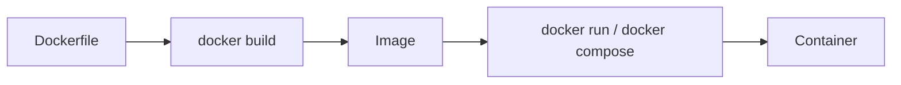
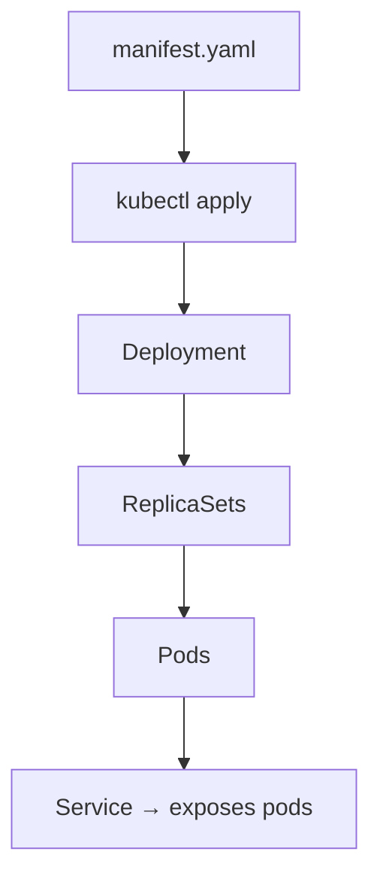

# Docker & Kubernetes Labs — Step‑by‑Step Learner Guide for Labs

**Course Code:** TGS-2021010366

**Course Title:** Docker & Kubernetes Labs

## Table of Contents

1. [Before You Start — Setup & Prerequisites](#before-you-start)
2. [Docker — Install & Verify (macOS)](#docker-install)
  - [Option A — Docker Desktop (recommended)](#docker-desktop)
  - [Quick verification commands](#docker-verify)
3. [Accessing Docker on Kodakiller (lab host)](#kodakiller-docker)
4. [Kubernetes — Install & Access](#kubernetes-install)
  - [kubectl (CLI)](#kubectl)
  - [Accessing the Kodakiller Kubernetes cluster](#kodakiller-k8s)
5. [Labs structure & how to run each lab](#labs-structure)
6. [Troubleshooting & tips](#troubleshooting)
7. [Visuals & diagrams](#visuals)

---

<a name="before-you-start"></a>
## 0. Before You Start — Setup & Prerequisites

- **Accounts & tools you need:** Docker Hub account (optional), access credentials for Kodakiller (SSH or lab portal), and the kubeconfig provided for the Kodakiller Kubernetes cluster.
- **Local tools:** a modern browser, a terminal (zsh/bash), `docker`, `docker compose`, and `kubectl`.
- **Repository reference:** all lab materials are in the repository folders under [docker/](docker/) and [kubernetes/](kubernetes/).

---

<a name="docker-install"></a>
## 1. Docker — Install & Verify (macOS)

<a name="docker-desktop"></a>
### Option A — Docker Desktop (recommended for macOS)

1. Install via Homebrew (recommended):

```bash
brew install --cask docker
```

2. Start Docker Desktop from Applications and allow the required permissions.
3. Confirm Docker is running (whale icon in the menu bar) and open the terminal to run verification commands below.

Notes:
- Docker Desktop includes the Docker Engine, Docker CLI, and Docker Compose.
- If you prefer the direct installer, download from: https://www.docker.com/products/docker-desktop

<a name="docker-verify"></a>
### Quick verification commands

```bash
docker --version
docker compose version
docker run --rm hello-world
docker ps -a
```

If `hello-world` runs and prints a success message, Docker is working.

---

<a name="kodakiller-docker"></a>
## 2. Accessing Docker on Kodakiller (lab host)

You will be given lab access details for the Kodakiller host (SSH credentials or a web lab portal). Follow these general steps — replace placeholders with the values provided by your instructor:

1. SSH into Kodakiller (example):

```bash
ssh <your-username>@kodakiller.example.edu
```

2. Verify Docker is installed on the host:

```bash
docker --version
sudo docker ps -a   # some hosts require sudo to run docker
```

3. If Docker commands require `sudo` and you prefer no-sudo, ask the instructor to add your user to the `docker` group, or run `sudo` as required.

4. Running lab containers on Kodakiller:
 - Copy the lab folder to the host (if necessary) or `cd` into the provided lab folder.
 - Use `docker compose up -d` (where a `docker-compose.yml` is present) or `docker build` then `docker run` for single Dockerfiles.

Example — start a lab compose:

```bash
cd ~/labs/docker/lab10   # or the path given by the instructor
docker compose up -d
docker compose logs -f
```

---

<a name="kubernetes-install"></a>
## 3. Kubernetes — Install & Access

This guide covers installing the CLI and accessing the Kodakiller cluster. For local testing you can use `minikube` or `kind`, but for lab work you'll connect to the Kodakiller cluster using a provided kubeconfig.

<a name="kubectl"></a>
### Install `kubectl` (macOS)

Install via Homebrew and verify:

```bash
brew install kubectl
kubectl version --client --short
```

Optional: install `minikube` (local single-node cluster):

```bash
brew install minikube
minikube start --driver=hyperkit
kubectl get nodes
```

<a name="kodakiller-k8s"></a>
### Accessing the Kodakiller Kubernetes cluster

You will receive either:
- a kubeconfig file (recommended) or
- instructions to download the kubeconfig from the lab portal.

Steps to configure access with a kubeconfig file:

1. Place the kubeconfig file in `~/.kube/kodakiller-config` (or a safe path).

```bash
mkdir -p ~/.kube
cp /path/to/kodakiller-config ~/.kube/kodakiller-config
```

2. Use `kubectl` with the file directly or merge into your default config:

```bash
# Use directly
KUBECONFIG=~/.kube/kodakiller-config kubectl get nodes

# Or merge to your default (~/.kube/config)
KUBECONFIG=~/.kube/config:~/.kube/kodakiller-config kubectl config view --merge --flatten > ~/.kube/config.tmp
mv ~/.kube/config.tmp ~/.kube/config
kubectl config get-contexts
kubectl config use-context <kodakiller-context-name>
kubectl get nodes
```

3. Verify you can list namespaces and pods:

```bash
kubectl get namespaces
kubectl get pods --all-namespaces
```

4. Deploy a sample pod from the lab folder (example):

```bash
kubectl apply -f kubernetes/lab13/pod.yaml
kubectl get pods -n default
kubectl describe pod <pod-name>
```

Notes:
- If you cannot reach the API server, confirm your network connection and that the kubeconfig references a reachable API endpoint. Ask the instructor for the correct kubeconfig if needed.
- Some clusters require VPN or institutional network access — follow the lab access instructions provided to you.

---

<a name="labs-structure"></a>
## 4. Labs structure & how to run each lab

- The repository organizes labs under [docker/](docker/) and [kubernetes/](kubernetes/).
- Example lab files:
  - [docker/lab10/Dockerfile](docker/lab10/Dockerfile) — an example app and compose in `docker/lab10`.
  - [kubernetes/lab13/pod.yaml](kubernetes/lab13/pod.yaml) — sample pod definition.

General steps to run a Docker lab locally:

1. Open the lab folder: `cd docker/lab10`.
2. Build or start with compose:

```bash
docker compose up --build -d
```

3. Follow the lab's `lab.md` for exercise-specific commands and verification steps.

General steps to run a Kubernetes lab on Kodakiller:

1. Ensure kubeconfig is configured as shown above.
2. Apply the manifest from the lab folder:

```bash
kubectl apply -f kubernetes/lab13/pod.yaml
kubectl get pods -n default
kubectl logs <pod-name>
```

---

<a name="troubleshooting"></a>
## 5. Troubleshooting & tips

- Docker CLI permission denied: run with `sudo` or ask to be added to `docker` group.
- `docker compose` not found: upgrade Docker or install the `docker-compose` plugin.
- kubeconfig connection refused: check VPN / network and correct API server address in the kubeconfig.
- Pod stuck in CrashLoopBackOff: inspect `kubectl describe pod` and `kubectl logs`.

---

<a name="visuals"></a>
## 6. Visuals & diagrams

Docker workflow (build → run):



Kubernetes deployment flow (apply → pod → service):



Image placeholders (replace with screenshots for your cohort):


---

## 7. Where to get help

- Instructor / lab portal for Kodakiller credentials and kubeconfig.
- Open a GitHub issue in this repository with the `lab` label and include logs/commands you ran.

---

Good luck — build the labs in order, starting from [docker/lab1/lab.md](docker/lab1/lab.md) up to the Kubernetes labs.
