# Application Integration with Docker and Kubernetes — Learner Guide

**Course Code:** TGS-2021010366

**Course Title:** Application Integration with Docker and Kubernetes

**Trainer:** Dr. Alfred Ang · Tertiary Infotech Academy

---

This 2-day course takes you from zero to running **multi-container applications** with Docker and orchestrating them with Kubernetes. The labs are hands-on throughout — every concept is immediately applied in a KillerCoda browser sandbox so there is nothing to install.

**Day 1 — Docker** builds up five skills in sequence: running containers, persisting data, networking, configuration, and multi-service orchestration with Compose.

**Day 2 — Kubernetes** moves from single-host Docker to a cluster: Pods, Namespaces, Deployments, rolling updates, Services, persistent volumes, and scheduled Jobs.

> 💡 **Emoji legend:**
> 🐳 Docker · ☸️ Kubernetes · 📦 Image/Container · 🧩 Compose · 🗄️ Volume/Storage · 🌐 Network/Service · ⚙️ Config/Env · 🚀 Deployment · ⏰ Job/CronJob · ✅ Test/Verify · ⚠️ Warning

---

## Course Map

| Day | Scenario | Labs | Topics |
|---|---|---|---|
| **Day 1** | 1 — Docker Fundamentals | 1–4 | Run containers, build images, Flask app |
| **Day 1** | 2 — Docker Storage | 5a–5b | Named volumes, bind mounts |
| **Day 1** | 3 — Docker Networking | 6–7 | Custom networks, port mapping |
| **Day 1** | 4 — Docker Config | 8 | Environment variables |
| **Day 1** | 5 — Docker Compose | 10–12 | Compose, multi-service, full-stack |
| **Day 2** | 1 — Pods & Namespaces | 13–14 | Pods, Namespaces |
| **Day 2** | 2 — Deployments | 15 | Deployments, scaling, self-healing |
| **Day 2** | 3 — Rolling Updates | 16 | Rolling updates, rollbacks |
| **Day 2** | 4 — Services | 17 | ClusterIP, NodePort |
| **Day 2** | 5 — Storage & Jobs | 18–19 | PV/PVC, Jobs, CronJobs |

> **Lab 9 — Push to Docker Hub** is covered as a reference topic (theory slide). No KillerCoda activity is required.

---

## Table of Contents

- [Before You Start — Setup & Prerequisites](#before-you-start)
- [**Day 1 — Docker**](#day-1)
  - [Scenario 1 — Docker Fundamentals](#scenario-1)
    - [Lab 1 — Run Your First Container](#lab-1)
    - [Lab 2 — Run Nginx & Copy a File Out](#lab-2)
    - [Lab 3 — Build a Python Image with a Dockerfile](#lab-3)
    - [Lab 4 — Build & Run a Flask App; Inspect Containers](#lab-4)
  - [Scenario 2 — Docker Storage](#scenario-2)
    - [Lab 5a — Persist Data with Named Volumes](#lab-5a)
    - [Lab 5b — Live-share with Bind Mounts](#lab-5b)
  - [Scenario 3 — Docker Networking](#scenario-3)
    - [Lab 6 — Connect Containers with Custom Networks](#lab-6)
    - [Lab 7 — Publish Ports with Port Mapping](#lab-7)
  - [Scenario 4 — Docker Config](#scenario-4)
    - [Lab 8 — Configure with Environment Variables](#lab-8)
  - [Reference — Push to Docker Hub (Lab 9)](#lab-9-ref)
  - [Scenario 5 — Docker Compose](#scenario-5)
    - [Lab 10 — Single Service with Compose](#lab-10)
    - [Lab 11 — Two Services: Flask + Redis](#lab-11)
    - [Lab 12 — Full Stack: Web + PostgreSQL + Redis](#lab-12)
- [**Day 2 — Kubernetes**](#day-2)
  - [Scenario 1 — Pods & Namespaces](#k8s-scenario-1)
    - [Lab 13 — Create & Inspect Pods](#lab-13)
    - [Lab 14 — Isolate Resources with Namespaces](#lab-14)
  - [Scenario 2 — Deployments](#k8s-scenario-2)
    - [Lab 15 — Scale & Self-Heal with Deployments](#lab-15)
  - [Scenario 3 — Rolling Updates](#k8s-scenario-3)
    - [Lab 16 — Rollouts & Rollbacks](#lab-16)
  - [Scenario 4 — Services](#k8s-scenario-4)
    - [Lab 17 — Expose Pods with Services](#lab-17)
  - [Scenario 5 — Storage & Jobs](#k8s-scenario-5)
    - [Lab 18 — Volumes, PV & PVC](#lab-18)
    - [Lab 19 — Jobs & CronJobs](#lab-19)
- [Final Assessment — Practical Tests](#assessment)
- [Troubleshooting Cheat-Sheet](#troubleshooting)
- [Glossary](#glossary)

---

<a name="before-you-start"></a>
## Before You Start — Setup & Prerequisites

### Accounts & tools you need

| You need | Why | Where |
|---|---|---|
| **KillerCoda account** (free) | Browser-based lab sandbox — Docker and `kubectl` pre-installed | https://killercoda.com |
| **A web browser** | Run labs and open apps (`http://localhost:…`) | any modern browser |
| **Docker Hub account** (free) | Push/pull images (Lab 9 reference topic) | https://hub.docker.com/ |
| **The lab files** | Dockerfiles, YAML, sample apps | [GitHub repo](https://github.com/tertiarycourses/TGS-2021010366-Application-Integration-with-Docker-and-Kubernetes) |

> ✅ **All Day 1 Docker labs and Day 2 Kubernetes labs run in the KillerCoda browser sandbox.** Nothing needs to be installed on your local machine.

**KillerCoda lab scenarios for this course:**

| Day | Scenario folder | URL |
|---|---|---|
| Day 1 | day1-01-docker-fundamentals | https://killercoda.com/tertiarycourses/scenario/day1-01-docker-fundamentals |
| Day 1 | day1-02-docker-storage | https://killercoda.com/tertiarycourses/scenario/day1-02-docker-storage |
| Day 1 | day1-03-docker-networking | https://killercoda.com/tertiarycourses/scenario/day1-03-docker-networking |
| Day 1 | day1-04-docker-config | https://killercoda.com/tertiarycourses/scenario/day1-04-docker-config |
| Day 1 | day1-05-docker-compose | https://killercoda.com/tertiarycourses/scenario/day1-05-docker-compose |
| Day 2 | day2-01-k8s-pods-namespaces | https://killercoda.com/tertiarycourses/scenario/day2-01-k8s-pods-namespaces |
| Day 2 | day2-02-k8s-deployments | https://killercoda.com/tertiarycourses/scenario/day2-02-k8s-deployments |
| Day 2 | day2-03-k8s-rollouts | https://killercoda.com/tertiarycourses/scenario/day2-03-k8s-rollouts |
| Day 2 | day2-04-k8s-services | https://killercoda.com/tertiarycourses/scenario/day2-04-k8s-services |
| Day 2 | day2-05-k8s-storage-jobs | https://killercoda.com/tertiarycourses/scenario/day2-05-k8s-storage-jobs |

### Download the lab files (optional — for local reference)

```bash
git clone https://github.com/tertiarycourses/TGS-2021010366-Application-Integration-with-Docker-and-Kubernetes.git
cd TGS-2021010366-docker-kubernetes
```

The repo is laid out as:

```
docker/        ← Day 1 labs (lab1 … lab12)
kubernetes/    ← Day 2 labs (lab13 … lab19)
tests/         ← Final assessment (test1 … test4)
```

### Concept primer — VM vs Container, Image vs Container

A **Virtual Machine** ships a whole guest OS on top of a hypervisor — heavy. A **container** shares the host kernel and ships only your app + its libraries — light, fast to start, and dense.

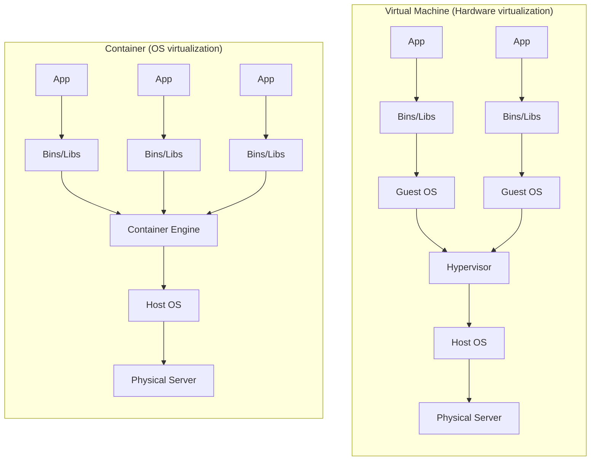

An **image** is the read-only blueprint (built from a Dockerfile). A **container** is a running instance of an image. `docker run` turns one into the other:

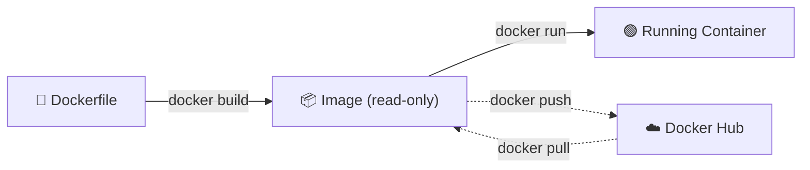

| Feature | 🖥️ Virtual Machine | 📦 Container |
|---|---|---|
| OS | Full guest OS | Shares host kernel |
| Disk footprint | GBs (heavy) | MBs (light) |
| Boot speed | Minutes | Seconds / milliseconds |
| Isolation | Strong (hardware) | Lighter (process/namespace) |
| Best for | Legacy, strict isolation | Microservices, density, CI/CD |

---

<a name="day-1"></a>
# Day 1 — Docker 🐳

**Goal:** become fluent with the Docker container lifecycle — run, build, persist, network, configure, and orchestrate.

The container lifecycle you will practise throughout Day 1:

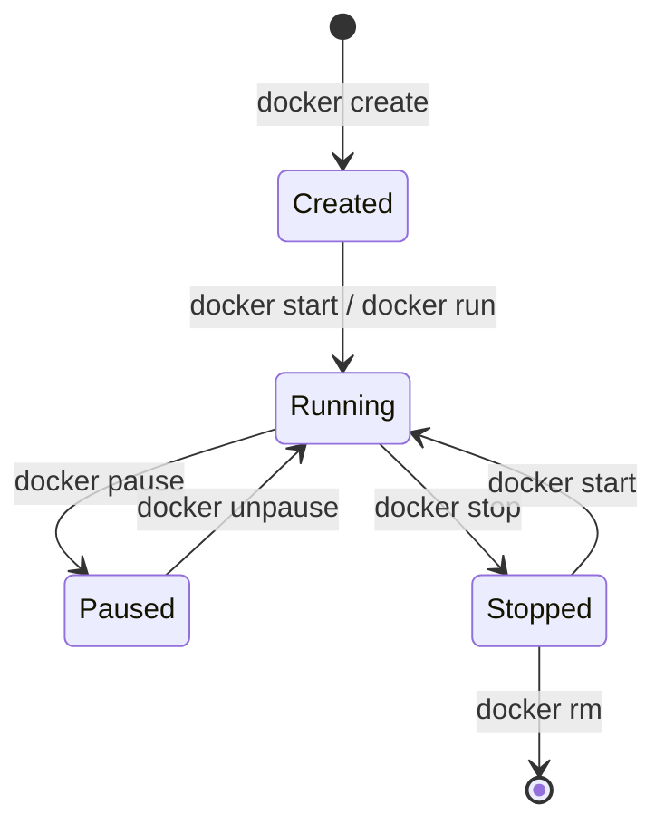

---

<a name="scenario-1"></a>
## Scenario 1 — Docker Fundamentals

**Labs 1–4 · KillerCoda:** https://killercoda.com/tertiarycourses/scenario/day1-01-docker-fundamentals

**Goal:** master the container lifecycle — run, build, inspect, and manage images and containers.

---

<a name="lab-1"></a>
### Lab 1 — Run Your First Container

**Goal:** start an interactive Ubuntu container, look inside it, and list containers.

Folder: [`docker/lab1/`](docker/lab1/)

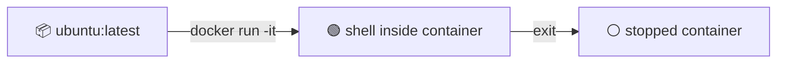

#### Steps

1. **Run an interactive Ubuntu container.** `-it` gives you an interactive terminal:

   ```bash
   docker run -it ubuntu:latest
   ```

   Docker pulls the image (first time only) and drops you to a shell like `root@<id>:/#`.

2. **Look around inside the container** — view its hosts file:

   ```bash
   cat /etc/hosts
   ```

3. **Exit the container** (this stops it):

   ```bash
   exit
   ```

4. **List containers:**

   ```bash
   docker ps        # running containers only — your ubuntu is NOT here
   docker ps -a     # ALL containers, including the stopped ubuntu
   ```

✅ **Test it:** `docker ps -a` shows your `ubuntu` container with status `Exited`.

> ❓ **Why isn't `ubuntu` in `docker ps`?** A container lives only as long as its main process. Ubuntu's "process" was your shell — when you `exit`, the process ends and the container stops. `docker ps` shows running containers; `docker ps -a` shows stopped ones too.

**Key concepts:** `docker run -it`, image pull, container = running process, `docker ps` vs `docker ps -a`.

---

<a name="lab-2"></a>
### Lab 2 — Run Nginx & Copy a File Out

**Goal:** run a container in the background, run commands inside it, and copy files between container and host.

Folder: [`docker/lab2/`](docker/lab2/)

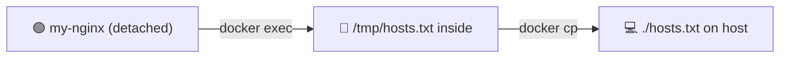

#### Steps

1. **Run nginx detached** (`-d` = background) and name it:

   ```bash
   docker run -d --name my-nginx nginx:latest
   ```

2. **Run a command inside the running container** — write a file:

   ```bash
   docker exec my-nginx sh -c "cat /etc/hosts > /tmp/hosts.txt"
   ```

3. **View that file from inside the container:**

   ```bash
   docker exec my-nginx cat /tmp/hosts.txt
   ```

4. **Copy the file out to your host machine:**

   ```bash
   docker cp my-nginx:/tmp/hosts.txt ./hosts.txt
   cat hosts.txt
   ```

5. **Clean up:**

   ```bash
   docker stop my-nginx && docker rm my-nginx
   ```

✅ **Test it:** `cat hosts.txt` on your host prints the container's hosts file.

**Key concepts:** `-d` detached, `--name`, `docker exec`, `docker cp`, `docker stop` + `docker rm`.

---

<a name="lab-3"></a>
### Lab 3 — Build a Python Image with a Dockerfile

**Goal:** turn your own code into an image with a Dockerfile, then run it.

Folder: [`docker/lab3/`](docker/lab3/) — contains `Dockerfile` and `main.py`.

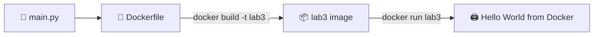

The pieces:

```python
# main.py
print("Hello World from Docker")
```

```dockerfile
# Dockerfile
FROM python:3.12-slim     # base image
WORKDIR /app              # working directory inside the image
COPY main.py .            # copy your code in
CMD ["python", "main.py"] # default command when the container starts
```

#### Steps

1. **Enter the lab folder:**

   ```bash
   cd docker/lab3
   ```

2. **Build the image** and tag it `lab3`. The `.` is the *build context* (current folder):

   ```bash
   docker build -t lab3 .
   ```

3. **Run the container:**

   ```bash
   docker run lab3
   ```

   You should see `Hello World from Docker`.

4. **List all containers** (the run exits immediately, so it's stopped):

   ```bash
   docker ps -a
   ```

5. **Remove the stopped container:**

   ```bash
   docker rm <container_id>
   ```

✅ **Test it:** `docker run lab3` prints the greeting; `docker images` lists `lab3`.

**Key concepts:** Dockerfile instructions (`FROM`, `WORKDIR`, `COPY`, `CMD`), build context `.`, image tag `-t`.

---

<a name="lab-4"></a>
### Lab 4 — Build & Run a Flask App; Inspect Containers

**Goal:** build a multi-layer Python web image, run it several ways, and inspect a running container.

Folder: [`docker/lab4/`](docker/lab4/) — contains `Dockerfile`, `app.py`, `requirements.txt`.

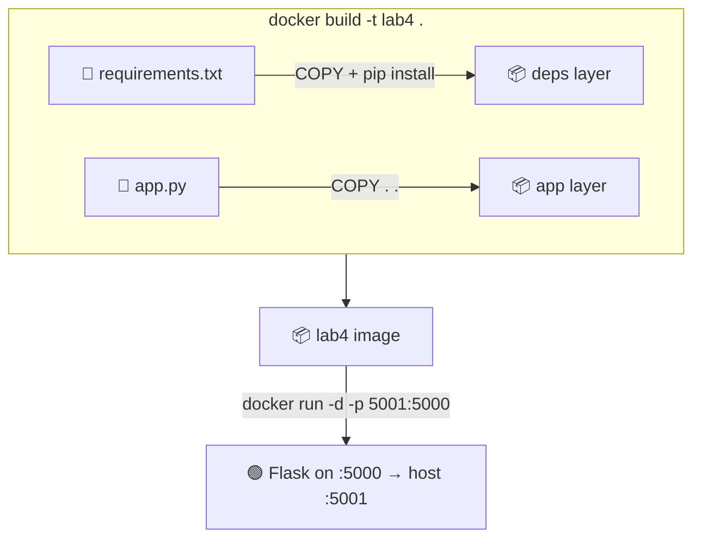

The Dockerfile copies `requirements.txt` **first** so the slow `pip install` layer is cached and reused on future builds:

```dockerfile
FROM python:3.12-slim
WORKDIR /app
COPY requirements.txt .
RUN pip install --no-cache-dir -r requirements.txt
COPY . .
EXPOSE 5000
CMD ["python", "app.py"]
```

#### Steps — Section 1: Build images

1. **Build and tag** the image:

   ```bash
   cd docker/lab4
   docker build -t lab4 .
   ```

2. **Explore the image:**

   ```bash
   docker images                 # list local images
   docker tag lab4 lab4:v1       # add a second tag (same image)
   docker history lab4           # see the layers + their sizes
   docker image inspect lab4     # full JSON metadata
   ```

#### Steps — Section 2: Run containers

3. **Run in the foreground** (Ctrl+C to stop):

   ```bash
   docker run -p 5001:5000 lab4
   ```

4. **Run detached** and open **http://localhost:5001**:

   ```bash
   docker run -d -p 5001:5000 --name my-app lab4
   ```

5. **Manage the container lifecycle:**

   ```bash
   docker ps                 # running
   docker ps -a              # all
   docker stop my-app
   docker start my-app
   docker restart my-app
   docker rename my-app my-flask-app
   docker stop my-flask-app && docker rm my-flask-app
   ```

#### Steps — Section 3: Inspect a container

6. **Start a fresh container to inspect:**

   ```bash
   docker run -d -p 5001:5000 --name my-app lab4
   ```

7. **Hit the app a few times** in your browser (`localhost:5001`), then inspect:

   | Command | What it shows |
   |---|---|
   | `docker logs my-app` | container stdout/stderr |
   | `docker logs -f my-app` | follow logs live (Ctrl+C to exit) |
   | `docker logs --tail 5 my-app` | last 5 log lines |
   | `docker exec my-app ls /app` | run a command inside |
   | `docker exec -it my-app /bin/bash` | open a shell inside |
   | `docker top my-app` | processes inside the container |
   | `docker inspect my-app` | full metadata (IP, mounts, env) |
   | `docker stats` | live CPU/memory/network (Ctrl+C) |
   | `docker port my-app` | port mappings |

8. **Clean up:**

   ```bash
   docker stop my-app && docker rm my-app
   ```

✅ **Test it:** `localhost:5001` returns *"Hello World from Docker!"*; `docker logs my-app` shows your requests.

> 💡 **Layer caching:** copying `requirements.txt` and installing **before** `COPY . .` means changing `app.py` only rebuilds the small app layer — not the slow dependency layer. **Layer-creating instructions:** `FROM`, `RUN`, `COPY`, `ADD`. **Metadata-only:** `CMD`, `EXPOSE`, `ENV`, `WORKDIR`, `ENTRYPOINT`, `LABEL`.

**Key concepts:** image layers, `docker history`, foreground vs detached, lifecycle commands, `docker logs`/`exec`/`inspect`/`stats`.

---

<a name="scenario-2"></a>
## Scenario 2 — Docker Storage

**Labs 5a–5b · KillerCoda:** https://killercoda.com/tertiarycourses/scenario/day1-02-docker-storage

**Goal:** keep data alive after a container is removed using a **named volume**, and live-share host files using a **bind mount**.

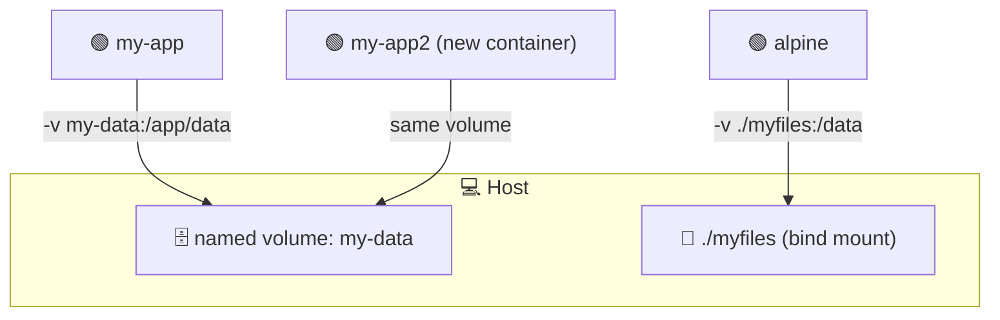

| | 🗄️ Named Volume | 📁 Bind Mount |
|---|---|---|
| Syntax | `-v my-data:/app/data` | `-v $(pwd)/folder:/app/data` |
| Managed by | Docker | You (host filesystem) |
| Best for | Databases, logs (persistence) | Live code editing (development) |
| Portability | Any machine | Tied to a host path |

---

<a name="lab-5a"></a>
### Lab 5a — Persist Data with Named Volumes

**Goal:** prove that data survives a container being deleted when stored in a named volume.

Folder: [`docker/lab5/`](docker/lab5/)

#### Steps

1. **Create and inspect a named volume:**

   ```bash
   docker volume create my-data
   docker volume ls
   docker volume inspect my-data
   ```

2. **Run the Lab 4 Flask app with the volume mounted** at `/app/data`:

   ```bash
   docker run -d -p 5001:5000 --name my-app -v my-data:/app/data lab4
   ```

3. **Write a file into the volume, then verify it:**

   ```bash
   docker exec my-app sh -c "echo 'hello volumes' > /app/data/test.txt"
   docker exec my-app cat /app/data/test.txt
   ```

4. **Destroy the container, then start a brand-new one with the same volume** — the data is still there:

   ```bash
   docker stop my-app && docker rm my-app
   docker run -d -p 5001:5000 --name my-app2 -v my-data:/app/data lab4
   docker exec my-app2 cat /app/data/test.txt     # → hello volumes
   docker stop my-app2 && docker rm my-app2
   docker volume rm my-data
   ```

✅ **Test it:** the file written by `my-app` is readable by `my-app2`.

**Key concepts:** named volumes, `docker volume create/ls/inspect/rm`, data persistence beyond container life.

---

<a name="lab-5b"></a>
### Lab 5b — Live-share with Bind Mounts

**Goal:** share a host folder directly into a container so changes appear instantly on both sides.

Folder: [`docker/lab5/`](docker/lab5/)

#### Steps

1. **Create a host folder with a file, then mount it into a container:**

   ```bash
   mkdir -p myfiles
   echo "hello from host" > myfiles/note.txt
   docker run --rm -v $(pwd)/myfiles:/data alpine cat /data/note.txt
   ```

2. **Write from the container back to the host** — the file appears on your machine:

   ```bash
   docker run --rm -v $(pwd)/myfiles:/data alpine sh -c "echo 'hello from container' > /data/reply.txt"
   cat myfiles/reply.txt        # → hello from container
   rm -rf myfiles
   ```

✅ **Test it:** `reply.txt` created inside the container appears on your host.

**Key concepts:** bind mounts, `-v $(pwd)/folder:/path`, host ↔ container bidirectional sharing.

---

<a name="scenario-3"></a>
## Scenario 3 — Docker Networking

**Labs 6–7 · KillerCoda:** https://killercoda.com/tertiarycourses/scenario/day1-03-docker-networking

**Goal:** put containers on a custom network so they can talk by name, and control how ports are exposed to the host.

---

<a name="lab-6"></a>
### Lab 6 — Connect Containers with Custom Networks

**Goal:** put two containers on a custom network so they can reach each other **by name**, then disconnect/reconnect.

Folder: [`docker/lab6/`](docker/lab6/)

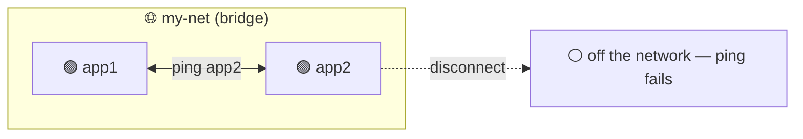

#### Steps

1. **List networks and create a custom bridge network:**

   ```bash
   docker network ls
   docker network create my-net
   docker network inspect my-net
   ```

2. **Run two containers on it** (BusyBox has `ping` built in; `sleep 3600` keeps them alive):

   ```bash
   docker run -d --name app1 --network my-net busybox sleep 3600
   docker run -d --name app2 --network my-net busybox sleep 3600
   ```

3. **Reach app2 from app1 by name** — Docker's built-in DNS resolves container names:

   ```bash
   docker exec app1 ping -c 2 app2
   ```

4. **Disconnect app2 and watch the ping fail, then reconnect and watch it work:**

   ```bash
   docker network disconnect my-net app2
   docker exec app1 ping -c 2 app2      # ❌ fails — app2 left the network
   docker network connect my-net app2
   docker exec app1 ping -c 2 app2      # ✅ works again
   ```

5. **Clean up:**

   ```bash
   docker stop app1 app2 && docker rm app1 app2
   docker network rm my-net
   ```

✅ **Test it:** ping succeeds on the same network, fails after disconnect, succeeds after reconnect.

**Key concepts:** custom bridge networks, DNS by container name, `network connect`/`disconnect`.

---

<a name="lab-7"></a>
### Lab 7 — Publish Ports with Port Mapping

**Goal:** understand how `-p host:container` exposes a container to your host — and what happens without it.

Folder: [`docker/lab7/`](docker/lab7/) — reuses the `lab4` Flask image (build it first if needed).

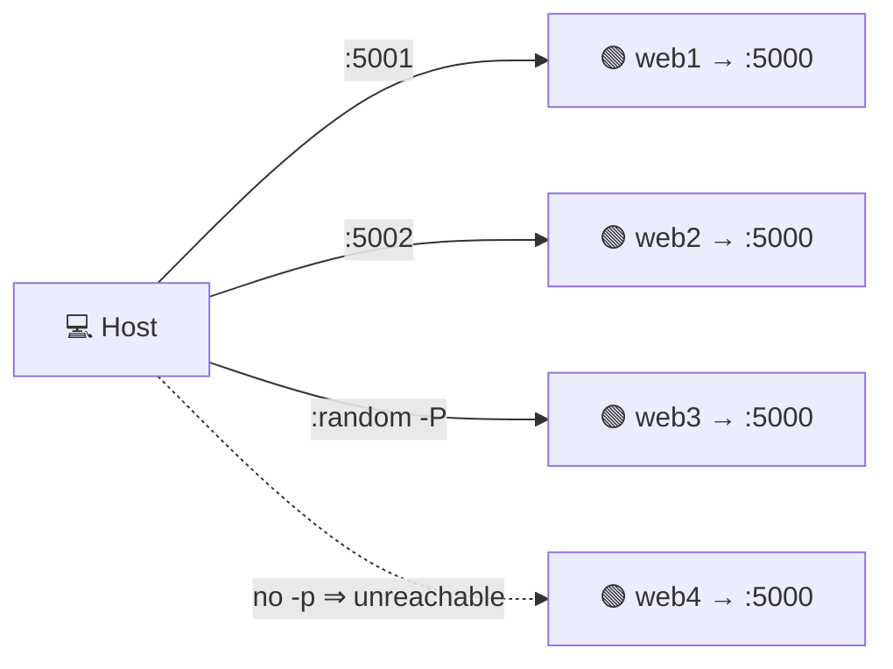

#### Steps

1. **Run two instances on different host ports** (same image, same container port 5000):

   ```bash
   docker run -d -p 5001:5000 --name web1 lab4
   docker run -d -p 5002:5000 --name web2 lab4
   ```

   Open **http://localhost:5001** and **http://localhost:5002** — same app, two ports.

2. **View each container's port mappings:**

   ```bash
   docker port web1
   docker port web2
   ```

3. **Let Docker pick a random host port** with `-P`, then find out which one:

   ```bash
   docker run -d -P --name web3 lab4
   docker port web3
   ```

4. **Run with no `-p` at all** — the app runs but is **not** reachable from the host:

   ```bash
   docker run -d --name web4 lab4
   docker exec web4 curl -s http://localhost:5000   # ✅ works from inside only
   ```

5. **Clean up:**

   ```bash
   docker stop web1 web2 web3 web4 && docker rm web1 web2 web3 web4
   ```

✅ **Test it:** `web1`/`web2` answer on `5001`/`5002`; `web4` only answers from inside the container.

**Key concepts:** `-p host:container`, multiple instances on different ports, `-P` random port, `EXPOSE` is documentation only — `-p` actually publishes.

---

<a name="scenario-4"></a>
## Scenario 4 — Docker Config

**Lab 8 · KillerCoda:** https://killercoda.com/tertiarycourses/scenario/day1-04-docker-config

**Goal:** pass configuration into a container at runtime, overriding Dockerfile defaults — no image rebuild needed.

---

<a name="lab-8"></a>
### Lab 8 — Configure with Environment Variables

**Goal:** pass configuration into a container at runtime, overriding Dockerfile defaults.

Folder: [`docker/lab8/`](docker/lab8/) — app prints `MY_NAME` and `MY_ENV`.

```dockerfile
FROM python:3.12-slim
WORKDIR /app
ENV MY_NAME=World        # defaults baked into the image
ENV MY_ENV=development
COPY app.py .
CMD ["python", "app.py"]
```

#### Steps

1. **Build and run with the defaults** from the Dockerfile:

   ```bash
   cd docker/lab8
   docker build -t lab8 .
   docker run lab8        # → Hello, World! / Environment: development
   ```

2. **Override one or more values** with `-e` at runtime:

   ```bash
   docker run -e MY_NAME=Alfred lab8
   docker run -e MY_NAME=Alfred -e MY_ENV=production lab8
   ```

3. **Use an env file** instead of many `-e` flags:

   ```bash
   echo "MY_NAME=Alfred" > .env
   echo "MY_ENV=production" >> .env
   docker run --env-file .env lab8
   ```

4. **List every env var inside a container:**

   ```bash
   docker run lab8 env
   ```

✅ **Test it:** the printed name/environment change to match whatever you pass with `-e` or `--env-file`.

**Key concepts:** `ENV` defaults, `-e KEY=value`, `--env-file`, runtime overrides win over image defaults.

---

<a name="lab-9-ref"></a>
## Reference — Push to Docker Hub (Lab 9)

> 📖 **Theory reference only — no KillerCoda activity.** This section covers the commands for pushing images to Docker Hub. You will practise these steps if time permits or as a self-study exercise.

Publishing an image makes it available to anyone with a Docker Hub account:

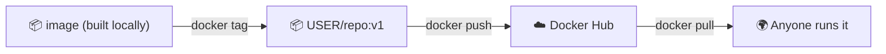

**Commands (replace `<your-username>` with your Docker Hub username):**

```bash
# Log in
docker login

# Tag the image with your username
docker tag lab4 <your-username>/lab4:v1

# Push it
docker push <your-username>/lab4:v1

# Tag and push a 'latest' pointer
docker tag lab4 <your-username>/lab4:latest
docker push <your-username>/lab4:latest

# Anyone can now pull and run it
docker pull <your-username>/lab4:v1
docker run -p 5001:5000 <your-username>/lab4:v1

docker logout
```

> 💡 **Tags 101:** `:v1`, `:v2` pin specific versions; `:latest` is just a convention for "the newest" — it is **not** automatic, you must push it yourself.

**Key concepts:** `docker login`, image naming `username/repo:tag`, `docker push`/`pull`, semantic tags vs `latest`.

---

<a name="scenario-5"></a>
## Scenario 5 — Docker Compose

**Labs 10–12 · KillerCoda:** https://killercoda.com/tertiarycourses/scenario/day1-05-docker-compose

**Goal:** describe a whole multi-container application in one `docker-compose.yml` and run it with a single command.

Compose reads a YAML file and builds/runs all your services, networks, and volumes together:

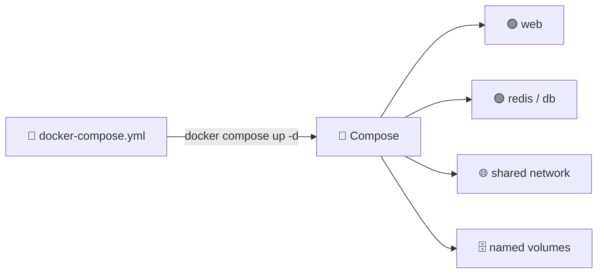

**The Compose workflow:** (1) write a `Dockerfile` for your app → (2) declare services in `docker-compose.yml` → (3) run `docker compose up`.

---

<a name="lab-10"></a>
### Lab 10 — Single Service with Compose

**Goal:** run one Flask service from a Compose file and use the core `compose` commands.

Folder: [`docker/lab10/`](docker/lab10/)

```yaml
# docker-compose.yml
services:
  web:
    build: .             # build from the Dockerfile in this folder
    ports:
      - "5001:5000"      # host:container
```

#### Steps

1. **Start the service in the background:**

   ```bash
   cd docker/lab10
   docker compose up -d
   ```

2. **List services and open the app:**

   ```bash
   docker compose ps
   ```

   Open **http://localhost:5001**.

3. **View and follow logs:**

   ```bash
   docker compose logs
   docker compose logs -f web      # follow just the web service
   ```

4. **Run commands inside the running service:**

   ```bash
   docker compose exec web python -c "print('inside the container!')"
   docker compose exec web /bin/bash
   ```

5. **Stop / start / tear down:**

   ```bash
   docker compose stop      # stop containers (keep them)
   docker compose start     # start them again
   docker compose down      # stop AND remove containers + network
   ```

✅ **Test it:** `localhost:5001` serves the Flask app; `docker compose ps` shows `web` as running.

**Key concepts:** `services`, `build`, `ports`, `up -d`, `ps`, `logs`, `exec`, `down`.

---

<a name="lab-11"></a>
### Lab 11 — Two Services: Flask + Redis

**Goal:** wire two services together — a web app that talks to a Redis cache by service name.

Folder: [`docker/lab11/`](docker/lab11/)


```yaml
# docker-compose.yml
services:
  web:
    build: .
    ports:
      - "5001:5000"
    environment:
      - REDIS_HOST=redis     # reach the other service by its name
    depends_on:
      - redis                # start redis first
  redis:
    image: redis:7-alpine
    ports:
      - "6379:6379"
```

#### Steps

1. **Bring up both services:**

   ```bash
   cd docker/lab11
   docker compose up -d
   docker compose ps          # web + redis both running
   ```

2. **Open the app and refresh** — the visit counter increments because it's stored in Redis:

   Open **http://localhost:5001** and refresh a few times.

3. **Inspect logs per service:**

   ```bash
   docker compose logs
   docker compose logs -f web
   ```

4. **Tear down:**

   ```bash
   docker compose down
   ```

✅ **Test it:** the counter on `localhost:5001` goes up on every refresh.

> 💡 **Service discovery:** inside a Compose network, `web` reaches Redis at the hostname `redis` — the service name *is* the DNS name. That's why `REDIS_HOST=redis` works with no IP addresses.

**Key concepts:** multi-service Compose, `environment`, `depends_on`, service-name DNS, stateful cache.

---

<a name="lab-12"></a>
### Lab 12 — Full Stack: Web + PostgreSQL + Redis

**Goal:** run a production-shaped stack — Node web server, PostgreSQL, and Redis — with health checks, named volumes, a custom network, and resource limits.

Folder: [`docker/lab12/`](docker/lab12/) — Node app under [`docker/lab12/app/`](docker/lab12/app/).

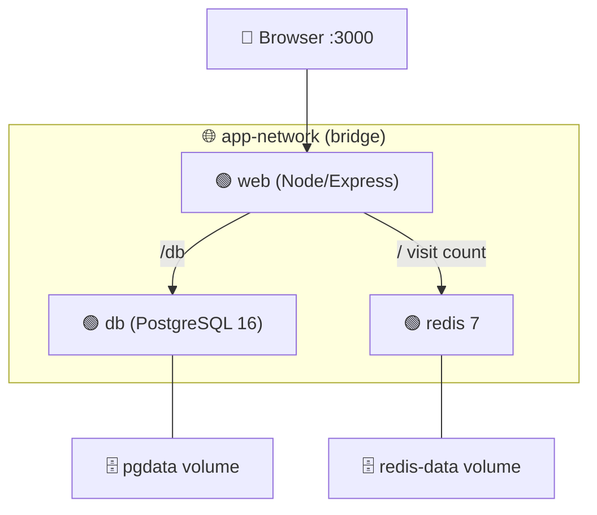

This Compose file demonstrates advanced features:

| Key | What it does |
|---|---|
| `build.args` | pass build-time variables (e.g. `NODE_ENV`) |
| `env_file` | load env vars from a `.env` file |
| `depends_on: condition: service_healthy` | wait until `db` passes its health check |
| `healthcheck` | how Docker decides a service is healthy |
| `restart: unless-stopped` | auto-restart on failure |
| `deploy.resources.limits` | cap CPU and memory |
| `networks` | custom bridge for service-to-service traffic |
| named `volumes` | persist database and cache data |

#### Steps

1. **Start the whole stack:**

   ```bash
   cd docker/lab12
   docker compose up -d
   ```

2. **Check health status** — `web` waits for `db` to be healthy first:

   ```bash
   docker compose ps
   ```

3. **Visit the three endpoints:**
   - **http://localhost:3000** — visit count (from Redis)
   - **http://localhost:3000/db** — current database time (from PostgreSQL)
   - **http://localhost:3000/health** — health-check endpoint

4. **View logs per service:**

   ```bash
   docker compose logs -f web
   docker compose logs -f db
   ```

5. **Query the database and the cache directly:**

   ```bash
   docker compose exec db psql -U user -d mydb -c "SELECT NOW();"
   docker compose exec redis redis-cli
   # inside redis-cli:  GET visits
   ```

6. **Watch resource usage, then tear down:**

   ```bash
   docker stats                 # live CPU/mem (Ctrl+C)
   docker compose down          # remove containers + network (KEEP volumes/data)
   docker compose down -v       # ALSO remove volumes (full data reset)
   ```

✅ **Test it:** all three endpoints respond; `/db` returns a timestamp; the visit count survives a `down`/`up` (but not `down -v`).

**Key concepts:** multi-service orchestration, `healthcheck` + `depends_on` ordering, named volumes for persistence, custom networks, `deploy.resources.limits`, `down` vs `down -v`.

---

<a name="day-2"></a>
# Day 2 — Kubernetes ☸️

**Goal:** move from single-host Docker to a cluster. Schedule and manage workloads across nodes with Kubernetes.

> ⚠️ **Before starting Day 2:** open the KillerCoda Kubernetes playground or ensure `kubectl get nodes` shows a `Ready` node. All Day 2 labs run in KillerCoda.

A Kubernetes cluster = one **control plane** (API Server, Scheduler, Controller Manager, etcd) + one or more **worker nodes** that run your Pods:

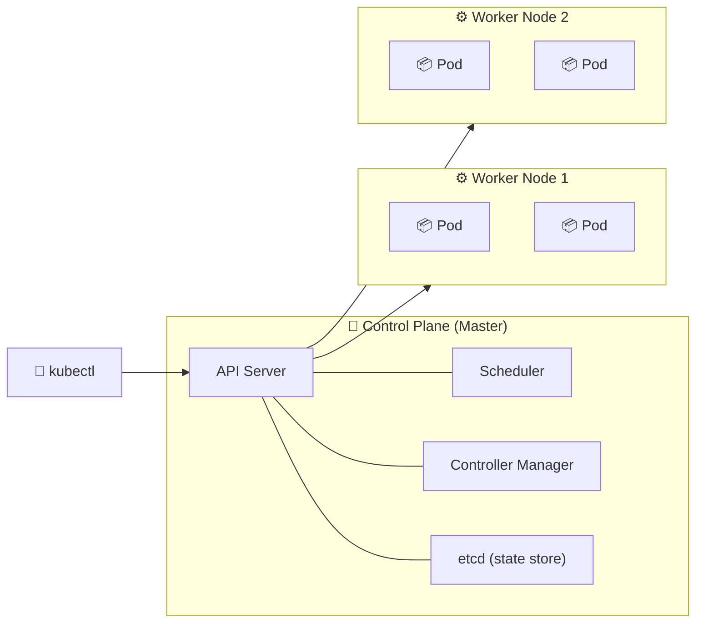

**`kubectl` command shape:** `kubectl [command] [TYPE] [NAME] [flags]` — e.g. `kubectl get pod my-app -o yaml`.

---

<a name="k8s-scenario-1"></a>
## Scenario 1 — Pods & Namespaces

**Labs 13–14 · KillerCoda:** https://killercoda.com/tertiarycourses/scenario/day2-01-k8s-pods-namespaces

**Goal:** schedule workloads as **Pods** — the smallest deployable unit — and organise them with **Namespaces**.

---

<a name="lab-13"></a>
### Lab 13 — Create & Inspect Pods

**Goal:** create the smallest deployable unit — a Pod — both imperatively (a command) and declaratively (YAML), and inspect it.

Folder: [`kubernetes/lab13/`](kubernetes/lab13/) — includes `pod.yaml`.

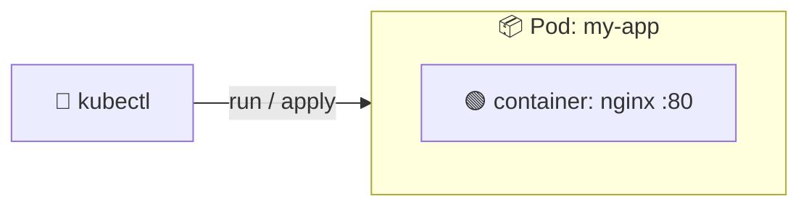

#### Steps — Part A: Imperative

1. **Create a Pod running Nginx:**

   ```bash
   kubectl run my-nginx --image=nginx
   ```

2. **Inspect it:**

   ```bash
   kubectl get pods                 # status
   kubectl get pods -o wide         # + IP and node
   kubectl describe pod my-nginx    # events, containers, volumes
   kubectl logs my-nginx            # container logs
   ```

3. **Run commands inside the Pod:**

   ```bash
   kubectl exec my-nginx -- cat /etc/hostname
   kubectl exec -it my-nginx -- /bin/sh
   ```

4. **Delete it:**

   ```bash
   kubectl delete pod my-nginx
   ```

#### Steps — Part B: Declarative (YAML)

5. **Look at `pod.yaml`** — the four required keys are `apiVersion`, `kind`, `metadata`, `spec`:

   ```yaml
   apiVersion: v1
   kind: Pod
   metadata:
     name: my-app
     labels:
       app: my-app
   spec:
     containers:
       - name: nginx
         image: nginx
         ports:
           - containerPort: 80
   ```

6. **Apply it, verify, and clean up:**

   ```bash
   kubectl apply -f pod.yaml
   kubectl get pods
   kubectl describe pod my-app
   kubectl delete -f pod.yaml
   ```

✅ **Test it:** `kubectl get pods` shows the Pod as `Running`; `kubectl logs` returns Nginx output.

> 💡 **Imperative vs declarative:** `kubectl run`/`create` is quick for experiments; YAML + `kubectl apply -f` is repeatable and version-controllable — the production approach.

**Key concepts:** Pod = smallest unit, `kubectl run` vs `apply -f`, the 4 manifest keys, `get`/`describe`/`logs`/`exec`, labels.

---

<a name="lab-14"></a>
### Lab 14 — Isolate Resources with Namespaces

**Goal:** use namespaces to keep resources from different teams/environments separate.

Folder: [`kubernetes/lab14/`](kubernetes/lab14/) — includes `namespace.yaml`, `pod-in-namespace.yaml`.

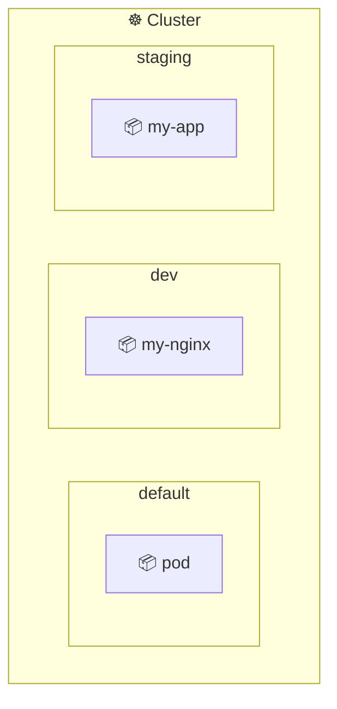

#### Steps — Part A: Imperative

1. **List existing namespaces, then create one:**

   ```bash
   kubectl get namespaces
   kubectl create namespace dev
   ```

2. **Run a Pod inside `dev` and list it** — note the `-n dev` flag everywhere:

   ```bash
   kubectl run my-nginx --image=nginx -n dev
   kubectl get pods -n dev
   kubectl get pods --all-namespaces
   ```

3. **Describe, then delete the Pod and the namespace** (deleting a namespace deletes everything in it):

   ```bash
   kubectl describe pod my-nginx -n dev
   kubectl delete pod my-nginx -n dev
   kubectl delete namespace dev
   ```

#### Steps — Part B: Declarative

4. **Create the namespace and a Pod inside it from YAML:**

   ```bash
   kubectl apply -f namespace.yaml          # creates "staging"
   kubectl apply -f pod-in-namespace.yaml   # Pod with namespace: staging
   kubectl get pods -n staging
   ```

5. **Clean up** — one delete removes the namespace and all its resources:

   ```bash
   kubectl delete -f namespace.yaml
   ```

✅ **Test it:** `kubectl get pods -n dev` shows the Pod only in `dev`, not in `default`.

| Namespace | Purpose |
|---|---|
| `default` | where Pods go if you don't specify one |
| `kube-system` | Kubernetes system components |
| `kube-public` | publicly readable resources |
| `kube-node-lease` | node heartbeat tracking |

**Key concepts:** `-n <namespace>`, `--all-namespaces`, `namespace:` in metadata, deleting a namespace cascades.

---

<a name="k8s-scenario-2"></a>
## Scenario 2 — Deployments

**Lab 15 · KillerCoda:** https://killercoda.com/tertiarycourses/scenario/day2-02-k8s-deployments

**Goal:** manage many identical Pods with a Deployment — scale up/down and watch it recreate Pods automatically.

---

<a name="lab-15"></a>
### Lab 15 — Scale & Self-Heal with Deployments

**Goal:** manage many identical Pods with a Deployment — scale up/down and watch it recreate Pods automatically.

Folder: [`kubernetes/lab15/`](kubernetes/lab15/) — includes `deployment.yaml`.

A Deployment manages a ReplicaSet, which keeps the desired number of Pods alive:

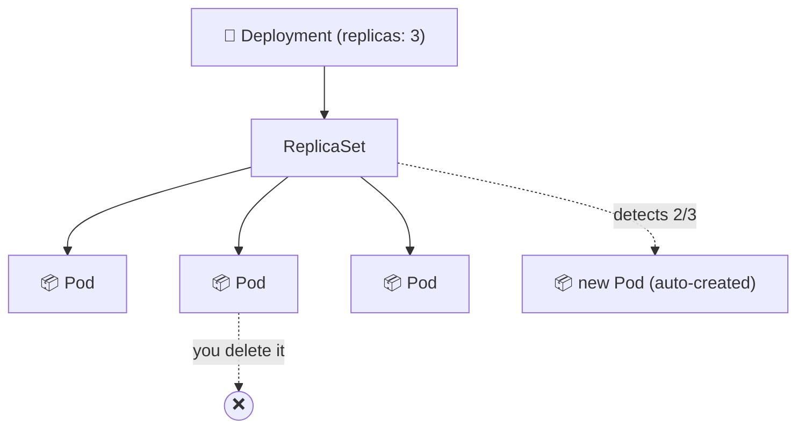

#### Steps — Part A: Imperative

1. **Create a Deployment and inspect what it made:**

   ```bash
   kubectl create deployment my-nginx --image=nginx
   kubectl get deployments
   kubectl get pods
   kubectl describe deployment my-nginx
   ```

2. **Scale to 3 replicas and watch the Pods appear:**

   ```bash
   kubectl scale deployment my-nginx --replicas=3
   kubectl get pods -w        # -w = watch live (Ctrl+C to stop)
   ```

3. **Delete one Pod — the Deployment recreates it** (self-healing):

   ```bash
   kubectl delete pod <pod-name>
   kubectl get pods           # still 3 running, one is brand new
   ```

4. **Scale back down and delete the Deployment:**

   ```bash
   kubectl scale deployment my-nginx --replicas=1
   kubectl get pods
   kubectl delete deployment my-nginx
   ```

#### Steps — Part B: Declarative

5. **Apply `deployment.yaml`** (note how `selector.matchLabels` must match `template.metadata.labels`):

   ```bash
   kubectl apply -f deployment.yaml
   kubectl get deployments
   kubectl get pods
   ```

6. **Change `replicas: 3` → `5` in the file, re-apply, and watch it scale:**

   ```bash
   kubectl apply -f deployment.yaml
   kubectl get pods
   ```

7. **Clean up:**

   ```bash
   kubectl delete -f deployment.yaml
   ```

✅ **Test it:** after deleting a Pod, `kubectl get pods` still shows the full replica count — Kubernetes replaced it.

**Key concepts:** Deployment → ReplicaSet → Pods, `kubectl scale`, self-healing, `selector` ↔ `template` label match, declarative scaling.

---

<a name="k8s-scenario-3"></a>
## Scenario 3 — Rolling Updates

**Lab 16 · KillerCoda:** https://killercoda.com/tertiarycourses/scenario/day2-03-k8s-rollouts

**Goal:** ship a new image version with zero downtime and roll back when needed.

---

<a name="lab-16"></a>
### Lab 16 — Rollouts & Rollbacks

**Goal:** ship a new image version with a rolling update, track revision history, and roll back when needed.

Folder: [`kubernetes/lab16/`](kubernetes/lab16/) — includes `deployment.yaml`.

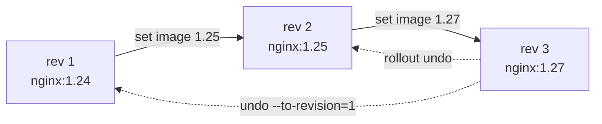

#### Steps

1. **Create a Deployment pinned to a specific version:**

   ```bash
   kubectl create deployment my-nginx --image=nginx:1.24 --replicas=3
   kubectl describe deployment my-nginx | grep Image
   ```

2. **Roll out a new version** — Kubernetes replaces Pods gradually (zero downtime):

   ```bash
   kubectl set image deployment my-nginx nginx=nginx:1.25
   kubectl rollout status deployment my-nginx
   kubectl describe deployment my-nginx | grep Image
   kubectl rollout history deployment my-nginx
   ```

3. **Roll out a third version** to build up history:

   ```bash
   kubectl set image deployment my-nginx nginx=nginx:1.27
   kubectl rollout status deployment my-nginx
   kubectl rollout history deployment my-nginx     # now 3 revisions
   ```

4. **Roll back** — to the previous revision, then to a specific one:

   ```bash
   kubectl rollout undo deployment my-nginx                  # → back to 1.25
   kubectl describe deployment my-nginx | grep Image
   kubectl rollout undo deployment my-nginx --to-revision=1  # → back to 1.24
   kubectl describe deployment my-nginx | grep Image
   ```

5. **(Declarative)** edit the image in `deployment.yaml`, `kubectl apply -f deployment.yaml`, then `kubectl rollout undo deployment my-app`. Clean up:

   ```bash
   kubectl delete deployment my-nginx
   ```

✅ **Test it:** `grep Image` reflects each new version after `set image`, and reverts after each `rollout undo`.

**Key concepts:** `set image`, rolling update, `rollout status`/`history`/`undo`, `--to-revision`, zero-downtime deploys.

---

<a name="k8s-scenario-4"></a>
## Scenario 4 — Services

**Lab 17 · KillerCoda:** https://killercoda.com/tertiarycourses/scenario/day2-04-k8s-services

**Goal:** give Pods a stable network identity. Pods are ephemeral (their IPs change); a Service gives a fixed name and load balancing.

---

<a name="lab-17"></a>
### Lab 17 — Expose Pods with Services

**Goal:** give Pods a stable network identity using ClusterIP (internal) and NodePort (external) Services.

Folder: [`kubernetes/lab17/`](kubernetes/lab17/) — includes `deployment.yaml`, `service.yaml`.

A Service uses a **label selector** to find its Pods and load-balances across them:

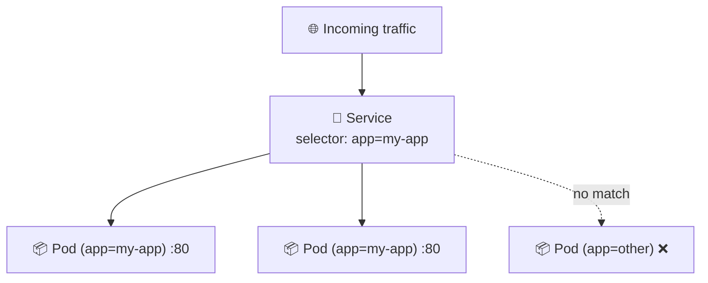

#### Steps — Part A: ClusterIP (inside the cluster only)

1. **Create a Deployment and expose it** (ClusterIP is the default type):

   ```bash
   kubectl create deployment my-nginx --image=nginx --replicas=2
   kubectl expose deployment my-nginx --port=80 --target-port=80
   kubectl get services
   kubectl describe service my-nginx
   ```

2. **Test it from inside the cluster** with a throwaway Pod:

   ```bash
   kubectl run test-pod --image=busybox --rm -it --restart=Never -- wget -O- my-nginx:80
   kubectl delete service my-nginx && kubectl delete deployment my-nginx
   ```

#### Steps — Part B: NodePort (reachable from outside)

3. **Expose as NodePort** — opens a static port on the node:

   ```bash
   kubectl create deployment my-nginx --image=nginx --replicas=2
   kubectl expose deployment my-nginx --type=NodePort --port=80 --target-port=80
   kubectl get service my-nginx          # note the 3xxxx NodePort
   ```

   Open **http://localhost:\<NodePort\>** in your browser, then clean up:

   ```bash
   kubectl delete service my-nginx && kubectl delete deployment my-nginx
   ```

#### Steps — Part C: Declarative

4. **Apply a Deployment + a NodePort Service from YAML** (`service.yaml` pins `nodePort: 30080`):

   ```bash
   kubectl apply -f deployment.yaml
   kubectl apply -f service.yaml
   kubectl get services
   kubectl get endpoints my-app-svc      # confirms Pods are linked
   ```

   Open **http://localhost:30080**, then clean up:

   ```bash
   kubectl delete -f service.yaml && kubectl delete -f deployment.yaml
   ```

✅ **Test it:** the `wget` returns the Nginx welcome HTML; the browser loads the page on the NodePort.

| Type | Reachable from | Use case |
|---|---|---|
| `ClusterIP` | inside the cluster only | service-to-service |
| `NodePort` | outside via `<NodeIP>:<NodePort>` | development, testing |
| `LoadBalancer` | external cloud load balancer | production (AWS/GCP/Azure) |

**Key concepts:** Service = stable endpoint, label `selector` → `endpoints`, `kubectl expose`, ClusterIP vs NodePort vs LoadBalancer, `port` vs `targetPort` vs `nodePort`.

---

<a name="k8s-scenario-5"></a>
## Scenario 5 — Storage & Jobs

**Labs 18–19 · KillerCoda:** https://killercoda.com/tertiarycourses/scenario/day2-05-k8s-storage-jobs

**Goal:** persist data beyond a Pod's life with PersistentVolumes and PersistentVolumeClaims, then run one-off and scheduled workloads with Jobs and CronJobs.

---

<a name="lab-18"></a>
### Lab 18 — Volumes, PV & PVC

**Goal:** share data between containers in a Pod (`emptyDir`) and persist data beyond a Pod's life with a PersistentVolume + PersistentVolumeClaim.

Folder: [`kubernetes/lab18/`](kubernetes/lab18/) — includes `emptydir-pod.yaml`, `pv.yaml`, `pvc.yaml`, `pod-with-pvc.yaml`.

```mermaid
flowchart LR
  ADM["👤 Admin creates"] --> PV["🗄️ PersistentVolume (1Gi)"]
  USR["🧑 User creates"] --> PVC["📄 PVC (500Mi request)"]
  PVC -->|binds to| PV
  POD["📦 Pod"] -->|claimName: my-pvc| PVC
```

#### Steps — Part A: Ephemeral `emptyDir` (shared between containers)

1. **Apply a two-container Pod that shares an `emptyDir`** — a writer and a reader:

   ```bash
   kubectl apply -f emptydir-pod.yaml
   kubectl get pod shared-pod
   kubectl exec shared-pod -c reader -- cat /data/message.txt   # → hello from writer
   kubectl delete pod shared-pod      # emptyDir data is gone with the Pod
   ```

#### Steps — Part B & C: PersistentVolume + Claim

2. **Create the PersistentVolume** (admin-provisioned storage, here a `hostPath`):

   ```bash
   kubectl apply -f pv.yaml
   kubectl get pv
   kubectl describe pv my-pv
   ```

3. **Create the PersistentVolumeClaim** — it requests storage and binds to the PV:

   ```bash
   kubectl apply -f pvc.yaml
   kubectl get pvc
   kubectl get pv         # STATUS should read "Bound" for both
   ```

#### Steps — Part D: Use the PVC and prove persistence

4. **Run a Pod that mounts the PVC and writes a file:**

   ```bash
   kubectl apply -f pod-with-pvc.yaml
   kubectl exec pvc-pod -- cat /data/file.txt    # → persistent data
   ```

5. **Delete the Pod, recreate it, and confirm the data survived** (because the PVC/PV still exist):

   ```bash
   kubectl delete pod pvc-pod
   kubectl apply -f pod-with-pvc.yaml
   kubectl exec pvc-pod -- cat /data/file.txt    # → persistent data (still there!)
   ```

6. **Clean up all storage resources:**

   ```bash
   kubectl delete pod pvc-pod
   kubectl delete pvc my-pvc
   kubectl delete pv my-pv
   ```

✅ **Test it:** the reader prints the writer's message; the PVC shows `Bound`; the file survives a Pod delete + recreate.

| Type | Lifetime | Use case |
|---|---|---|
| `emptyDir` | deleted with the Pod | temp files, sharing between containers |
| PersistentVolume (PV) | independent of Pods | admin-provisioned storage |
| PersistentVolumeClaim (PVC) | bound to a PV | a Pod's request for storage |

**Key concepts:** `emptyDir`, PV vs PVC, binding, `accessModes` (`ReadWriteOnce`), `hostPath`, persistence across Pod restarts.

---

<a name="lab-19"></a>
### Lab 19 — Jobs & CronJobs

**Goal:** run a task to completion with a **Job**, and run it on a schedule with a **CronJob**.

Folder: [`kubernetes/lab19/`](kubernetes/lab19/) — includes `job.yaml`, `cronjob.yaml`.

```mermaid
flowchart TD
  CJ["⏰ CronJob (schedule)"] -->|every interval| J["📋 Job"]
  J --> P1["📦 Pod (runs to completion)"]
  J --> P2["📦 Pod (parallel)"]
```

#### Steps — Part A: Job (imperative)

1. **Create a one-shot Job and read its output:**

   ```bash
   kubectl create job my-job --image=busybox -- echo "Hello from Job!"
   kubectl get jobs
   kubectl get pods
   kubectl logs job/my-job
   kubectl delete job my-job
   ```

#### Steps — Part B: Job (declarative, parallel)

2. **Apply a Job with `completions: 3` and `parallelism: 2`** — 2 Pods run at a time until 3 succeed:

   ```bash
   kubectl apply -f job.yaml
   kubectl get pods -w        # watch 2 parallel → 3 total completions
   kubectl get jobs
   kubectl logs job/countdown
   kubectl delete -f job.yaml
   ```

#### Steps — Part C & D: CronJob

3. **Create a CronJob that runs every minute** (imperative):

   ```bash
   kubectl create cronjob my-cron --image=busybox --schedule="*/1 * * * *" -- echo "Hello from CronJob!"
   kubectl get cronjobs
   # wait 1–2 minutes…
   kubectl get jobs
   kubectl logs job/$(kubectl get jobs --sort-by=.metadata.creationTimestamp -o jsonpath='{.items[-1].metadata.name}')
   kubectl delete cronjob my-cron
   ```

4. **Or apply a CronJob from YAML** (`cronjob.yaml` runs every 2 minutes):

   ```bash
   kubectl apply -f cronjob.yaml
   kubectl get cronjobs
   # wait 2–4 minutes…
   kubectl get jobs
   kubectl delete -f cronjob.yaml
   ```

✅ **Test it:** `kubectl logs job/...` prints the message; the CronJob spawns a new Job each interval.

**Cron schedule format** (`minute hour day-of-month month day-of-week`):

| Schedule | Meaning |
|---|---|
| `*/1 * * * *` | every minute |
| `*/5 * * * *` | every 5 minutes |
| `0 * * * *` | every hour |
| `0 0 * * *` | every day at midnight |
| `0 9 * * 1` | every Monday at 9am |

> 💡 **`restartPolicy`** for Jobs/CronJobs must be `OnFailure` or `Never` (not `Always`). `OnFailure` retries the same Pod; `Never` starts a fresh Pod each time. `backoffLimit` (default 6) caps retries before the Job is marked failed.

**Key concepts:** Job vs CronJob, `completions`/`parallelism`, `schedule` cron syntax, `restartPolicy`, `backoffLimit`, retained history.

---

<a name="assessment"></a>
## Final Assessment — Practical Tests

The assessment is **open book** (slides + this Learner Guide). Work in the [`tests/`](tests/) folders. Each test mirrors one course topic.

### Test 1 — Docker Fundamentals

Folder: [`tests/test1/`](tests/test1/) — a Flask note-taking app (`app.py`, `requirements.txt`).

- **Part A — Write a Dockerfile** that: uses `python:3.12-slim`; `WORKDIR /app`; copies `requirements.txt` then `pip install --no-cache-dir`; copies the rest; sets `ENV DATA_DIR=/app/data` and `ENV APP_PORT=5000`; declares `VOLUME /app/data`; `EXPOSE 5000`; runs `python app.py`.
- **Part B — Build & run:** tag the image `notes-app`, run it mapped to host port `5001`, add a note with `curl -X POST -d "note=Hello Docker" http://localhost:5001/add`, then read `curl http://localhost:5001/notes`.
- **Part C — Push to Docker Hub:** tag `<your-username>/notes-app:v1`, push it, and state the `docker pull` command someone else would run.
- **Part D — Conceptual:** layer order & caching; `EXPOSE` vs `-p`; named vs anonymous volumes; which instructions create layers; what happens to in-container data on `docker rm`.

> Reuses skills from Day 1 Scenarios 1–4.

### Test 2 — Docker Compose

Folder: [`tests/test2/`](tests/test2/)

- **Part A — Write `docker-compose.yml`** with two services: `db` (`mysql:8.0`, env `MYSQL_ROOT_PASSWORD/DATABASE/USER/PASSWORD`, named volume `db-data:/var/lib/mysql`) and `wordpress` (`wordpress:latest`, host `8080`→container `80`, env `WORDPRESS_DB_HOST=db` + creds, `depends_on: db`).
- **Part B — Run & verify:** `docker compose up -d`, `docker compose ps` (both running), open **http://localhost:8080** to reach the WordPress setup page.

> Reuses skills from Day 1 Scenario 5.

### Test 3 — Kubernetes Core Concepts

Folder: [`tests/test3/`](tests/test3/)

1. Create namespace `ckad-prep`.
2. In it, create Pod `mypod` with image `nginx:2.3.5`, port 80.
3. Identify why the container won't start; write the root cause to `pod-error.txt`. *(Hint: it's an image-pull / bad-tag issue — see the Troubleshooting table.)*
4. Change the image to `nginx:1.15.12`.
5. List the Pod and confirm it's `Running`.
6. Shell in, run `ls`, note the output, exit.
7. Get the Pod's IP address.
8. Run a temporary `busybox` Pod, shell in, and `wget` the `nginx` Pod on port 80.
9. Show the logs of `mypod`.
10. Delete the Pod and the namespace.

> Reuses skills from Day 2 Scenarios 1–2.

### Test 4 — Volumes & Services

Folder: [`tests/test4/`](tests/test4/)

- **Part A — Services:** Deployment `myapp` with 2 `nginx` replicas (port 80); expose it inside the cluster; `wget` it from a temporary `busybox` Pod; switch the Service type so it's reachable from outside; `wget` from outside.
- **Part B — Persistent storage:** PV `my-pv` (1Gi, `hostPath` `/tmp/k8s-data`); PVC `my-pvc` (500Mi); confirm it's `Bound`; Pod `storage-pod` (`busybox`) mounting the PVC at `/data` and writing `"hello from storage"` to `/data/message.txt`; delete + recreate the Pod and confirm the data persists; clean up Pod, PVC, PV.

> Reuses skills from Day 2 Scenarios 4–5.

---

<a name="troubleshooting"></a>
## Troubleshooting Cheat-Sheet

| Symptom | Likely cause | Fix |
|---|---|---|
| `Cannot connect to the Docker daemon` | Docker Desktop isn't running | Start Docker Desktop; wait for the 🐳 icon to settle. |
| `permission denied` on `docker …` (Linux) | user not in `docker` group | `sudo usermod -aG docker $USER` then re-login, or prefix `sudo`. |
| `docker compose: command not found` | old Docker / missing plugin | Upgrade Docker Desktop (Compose v2 is built in) or install the `docker-compose-plugin`. |
| `port is already allocated` | host port already in use | Use a different host port: `-p 5002:5000`, or stop the other container. |
| App not reachable at `localhost:PORT` | no `-p` published / wrong port | Re-run with `-p host:container`; check `docker port <name>`. |
| Container exits immediately | main process ended (e.g. plain `ubuntu`) | Give it a long-running command (`sleep 3600`) or run `-it` for a shell. |
| Data lost after `docker rm` | data wasn't on a volume | Mount a named volume: `-v my-data:/path`. |
| Pod stuck `ImagePullBackOff` / `ErrImagePull` | bad image name/tag, no registry access | Check the image name & tag exist; verify network/auth (this is the **Test 3** root cause). |
| Pod stuck `CrashLoopBackOff` | app/command inside crashes on start | `kubectl logs <pod>` and `kubectl describe pod <pod>` to read the error. |
| `CreateContainerConfigError` | missing ConfigMap/Secret referenced | Verify the named config object exists in the namespace. |
| `kubectl` can't reach the cluster | cluster not started / wrong context | Enable Kubernetes in Docker Desktop; `kubectl config get-contexts` + `use-context`. |
| PVC stuck `Pending` | no matching PV (size/accessMode) | Ensure a PV exists with ≥ requested size and matching `accessModes`. |
| Service returns nothing | selector doesn't match Pod labels | `kubectl get endpoints <svc>` — empty means labels don't match the `selector`. |

---

<a name="glossary"></a>
## Glossary

- **Image** 📦 — a read-only blueprint built from a Dockerfile; contains your app + dependencies.
- **Container** 🟢 — a running instance of an image.
- **Dockerfile** 📄 — a text file of instructions (`FROM`, `RUN`, `COPY`, `CMD`…) used to build an image.
- **Layer** — a cached filesystem diff produced by `FROM`/`RUN`/`COPY`/`ADD`; reused across builds.
- **Registry / Docker Hub** ☁️ — where images are stored and shared (`docker push`/`pull`).
- **Volume** 🗄️ — Docker-managed persistent storage that outlives a container.
- **Bind mount** 📁 — maps a host folder directly into a container (great for live editing).
- **Docker Compose** 🧩 — declares and runs multiple containers from one `docker-compose.yml`.
- **Service (Compose)** — one container definition in a Compose file; reachable by its service name.
- **Kubernetes (k8s)** ☸️ — orchestrator that schedules, scales, and heals containers across nodes.
- **Pod** — the smallest deployable unit in Kubernetes; wraps one or more containers.
- **Namespace** — a virtual partition for isolating resources within a cluster.
- **Deployment** 🚀 — manages a ReplicaSet to keep a desired number of Pods running and to roll out updates.
- **ReplicaSet** — ensures a specified number of identical Pods are always running.
- **Service (k8s)** 🔌 — a stable network endpoint + load balancer in front of Pods (ClusterIP / NodePort / LoadBalancer).
- **Selector / Label** — key-value tags on Pods; Services and ReplicaSets use selectors to find their Pods.
- **PersistentVolume (PV)** — cluster storage provisioned independently of any Pod.
- **PersistentVolumeClaim (PVC)** — a Pod's request for storage that binds to a PV.
- **Job** 📋 — runs a workload to successful completion.
- **CronJob** ⏰ — runs Jobs on a cron schedule.
- **kubectl** 🧑 — the Kubernetes command-line client (`kubectl [command] [TYPE] [NAME] [flags]`).
- **Imperative vs Declarative** — `kubectl run`/`create` (quick) vs `kubectl apply -f file.yaml` (repeatable, version-controlled).
- **KillerCoda** — browser-based lab sandbox with Docker and `kubectl` pre-installed; used for all hands-on labs in this course.

---

Complete Day 1 (Scenarios 1–5) then Day 2 (Scenarios 1–5) in order, then attempt the four practical tests. Good luck! 🐳☸️
